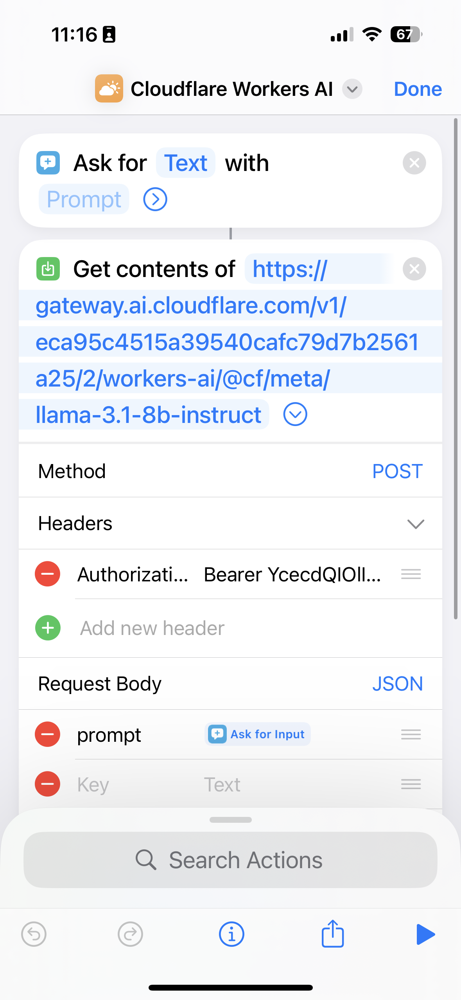
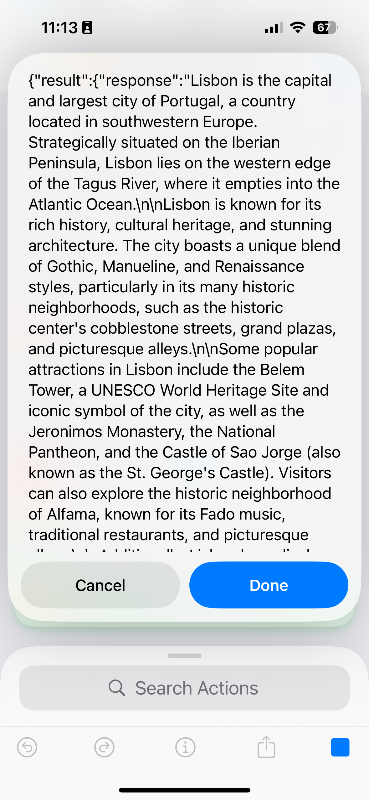
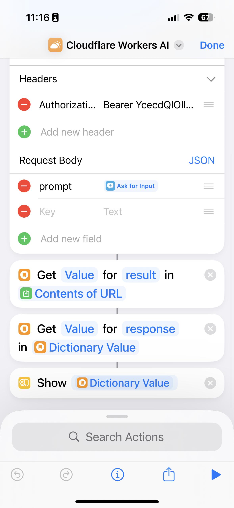
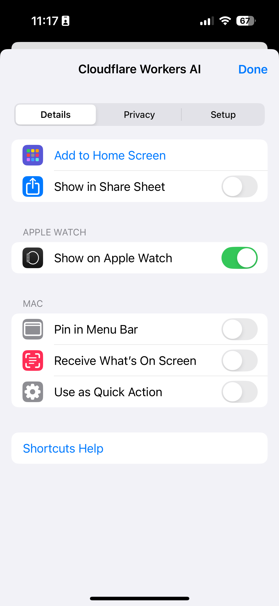
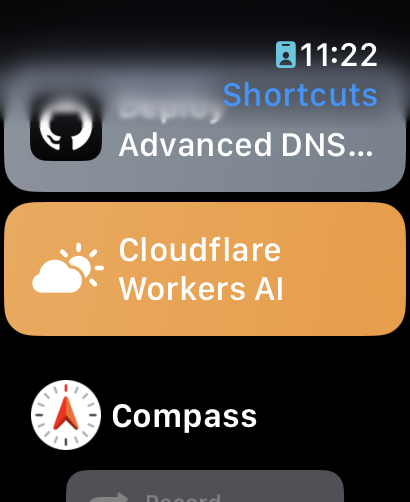
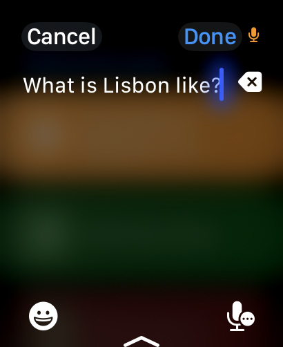
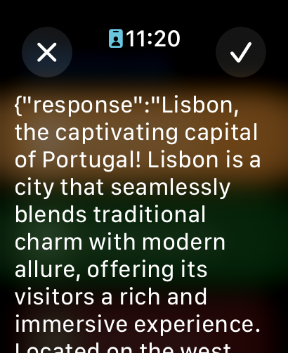

It has been nearly a year since I published a [walkthrough](https://blog.samrhea.com/category/walkthrough/) of any sort. The purpose of this blog has given way to unhinged anecdotes about [Portugal](https://blog.samrhea.com/category/portugal/) and rowdy [Texas](https://blog.samrhea.com/category/portugal/) stories.

Today I return to my roots! Apple released iOS 18 earlier this week but it was missing the biggest feature, their generative Artificial Intelligence (AI) platform called Apple Intelligence (also, cheekily, styled as _AI_). A*AI is scheduled for a beta launch later this year.

As someone who [frequently wears](https://blog.samrhea.com/posts/2024/apple-mechanical-watch/) an Apple Watch, I'm excited about the new capability but also impatient. I figured I could use Cloudflare Workers AI, Meta's Llama Large Language Model (LLM), and iOS Shortcuts to string together a tool of my own for the time being.

---

**🎯 I have a few goals for this project:**

* Use a leading LLM on my Apple Watch.
* Run that model in an environment that I control, specifically Cloudflare Workers AI.
* Log the requests and responses in an AI gateway for future analytics.

---

**🗺️ This walkthrough covers how to:**

* Set up Cloudflare Workers AI and AI Gateway.
* Configure an iOS Shortcut to use your Cloudflare Workers AI/AI Gateway deployment.

**⏲️Time to complete: ~15 minutes**

---

> **👔 I work there.** I [work](https://www.linkedin.com/in/samrhea/) at Cloudflare. Some of my posts on this blog that discuss Cloudflare [focus on building](https://blog.samrhea.com/tag/workers/) things with Cloudflare Workers. I'm a Workers customer and [pay](https://twitter.com/LakeAustinBlvd/status/1200380340382191617) my invoice to use it.

## Set Up Cloudflare Workers AI

Cloudflare's network provides a developer platform where builders can run compute workloads and rely on storage options. As part of that infrastructure, customers can now run AI inference. Those inference cases can be part of a larger application or just used for one-off workflows. You can see an example of a full-blown application I built last week that includes Workers AI feature, my Lisbon recommendation tool [here](https://lisbon-ai.samrhea.com/).

Cloudflare [supports a range](https://developers.cloudflare.com/workers-ai/models/) of the most popular generative AI models, including the latest/greatest from Meta, [Llama-3.1](https://developers.cloudflare.com/workers-ai/models/llama-3.1-8b-instruct). Meta provides the model, Cloudflare provides the infrastructure and tooling around it. This allows me to run a leading LLM for my own personal queries in an account where I control the configuration and data. I could use other models but I'll stick with Llama for this experiment.

I already have Cloudflare Workers AI configured in my account. What I also want, though, are the logs. I would like to retain the requests/responses out of curiosity - maybe I can go back and run a model on those historical queries or just take a look at how frequently I use the tool. [Cloudflare Workers AI](https://developers.cloudflare.com/workers-ai/) provides exactly this option. I'll start there.

First, I'll navigate to the `Workers AI` section of the Cloudflare dashboard - specifically the `AI Gateway` page. Once there, I can create a new AI Gateway which will receive requests to the inference model behind it, log the requests and responses, and apply other optional features like caching and rate limiting.

Since the model I plan to use is running on Cloudflare Workers AI, the setup in the next step is even easier. I can click the `API` button and the dashboard will share an API endpoint that I can use.

At the end of the path in that endpoint is a sample model. I'll edit it to use the specific Workers AI model in the next step. Before I do that, though, I need to create an API token that will allow me to call a model behind this API Gateway. I can do that from inside of the Workers AI section of the dashboard (example below) or from the API Token section as well.

## Set Up the iOS Shortcut

Alright, now I have an AI Gateway configured in Cloudflare, a model that I want to use available in Cloudflare Workers AI, and an API token that can access both. Up next, I need a way for my iPhone and Watch to send requests to that endpoint and receive responses. To do that, I am going to use the iOS Shortcuts app.

I'll start by grabbing a simple input action that will ask for text input. Next, I will add a `Get contents of` action that uses the URL from my AI Gateway with the specific model I want in the path.

I need to set the method to `POST` and add a couple of important details to the actual request. First, I need to set my Authorization token (do not worry, I have since rotated the one that you can see the first few characters from here).

Next, the Workers AI API expects to receive the prompt in a message called, well, `prompt`. What I need to do is define that as a Key here and then long-press the Text field to use the output from the input gathering action above.

If I try to run this, however, the response is going to come back as structured JSON like the example below. I need some way to strip it of that framing.

To do that, I'll use the `Get Dictionary Value` action that will parse the response for just the value contained in the `result`. However, inside of the `result` is the `response` so I need to repeat that step.

> Important note: I made a mistake here. In the `Show` action that concludes the shortcut, I am showing the output of the first `Get Dictionary Value`. I just need to edit that, but I was too lazy this round to go back and grab a new screenshot.

## Run the Shortcut on Apple Watch

Now I can go ahead and configure this Shortcut to appear on my Apple Watch by long-pressing the tile and going into the `Details` view.

Once configured, I can open the `Shortcuts` app on my watch (or call it with a spoken input or set it up as a quick click option in a watch face).

I can test it out with a simple question about Lisbon.

And it will respond with a description that I can read or listen to if I had my headphones in! (Again, I need to fix that second `Get Dictionary Value` to remove the `response` bit).

## What's next?

This is a far cry from what Apple Intelligence aims to be. It's still useful, though, in the same way that the ChatGPT app from OpenAI can be for one-off queries.

The real value from Apple Intelligence will be its ability to read from all of the data already on your device and to interact with the actions your device can take. That should be fantastic. Until then, this Shortcut covers one of the use cases that Apple Intelligence does intend to solve - more generic questions.

That said, you can imagine a few different use cases where you would want to expand on this concept even after Apple Intelligence lands. You extend this beyond just the basic LLM to also pull in data or materials from your organization and then team members in the field can use a shortcut to query it. You have specific system prompts that you want to apply when asking an AI to rewrite something - [prompts more specific](https://blog.samrhea.com/posts/2024/tone-rewriter/) than what Apple Intelligence will provide. It's going to take a village.
